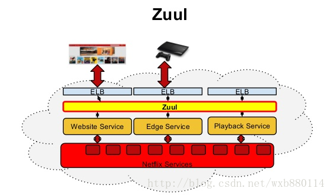
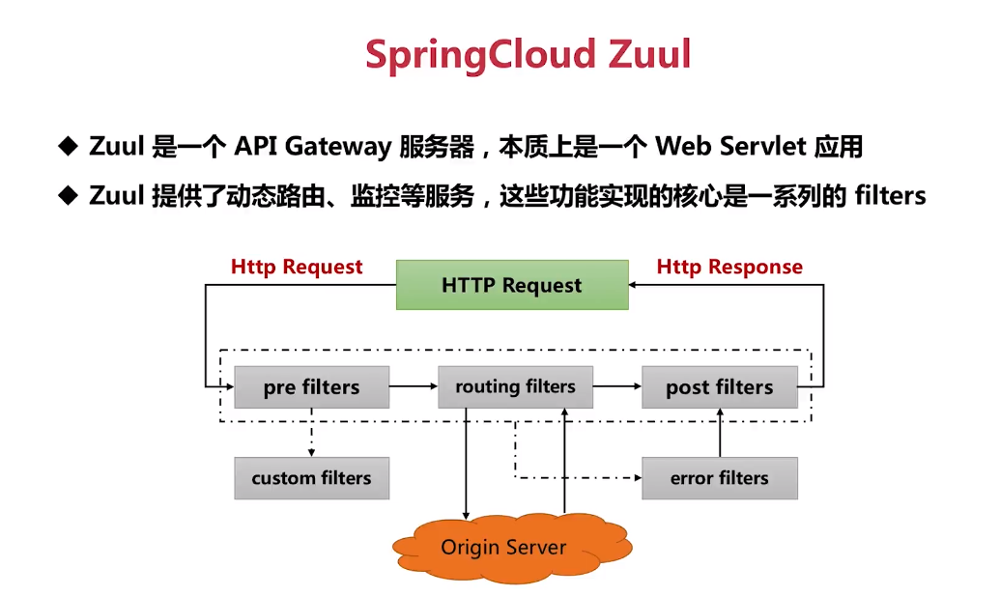
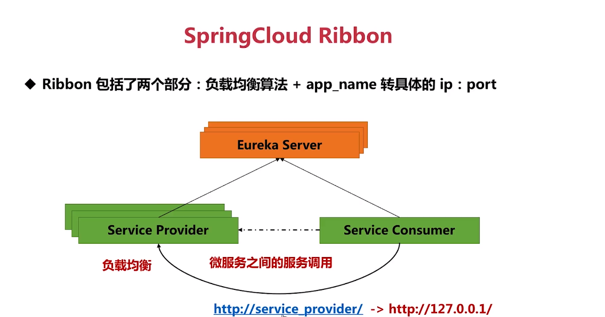
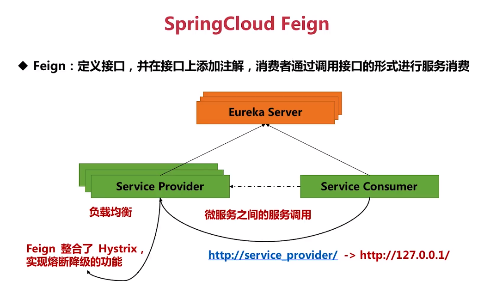
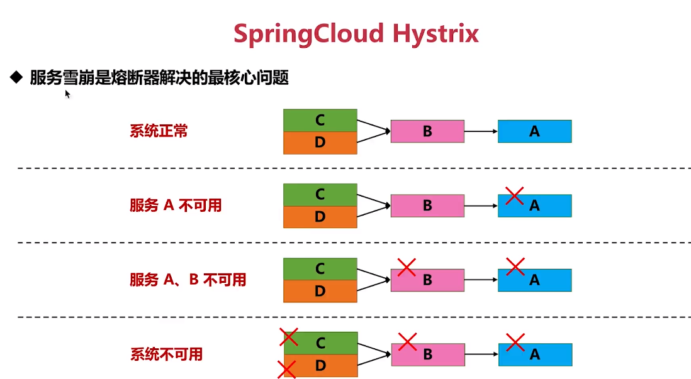
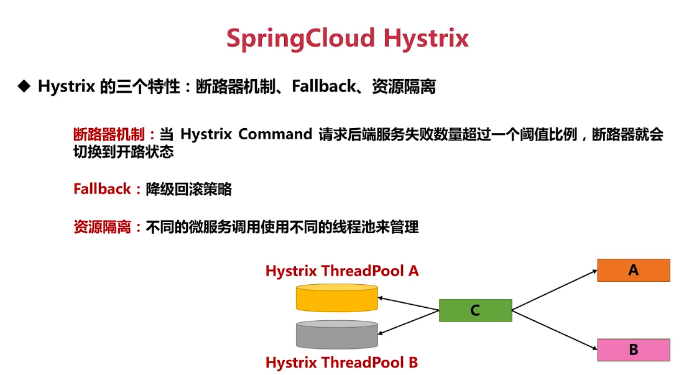

# ESM-springCloud
ESM（Earn some money）

近年来很多公司要求springcloud，作为一个在springMVC下写了很多年CRUD的码农，也想尝试一下微服务。

ESM（Earn some money）解释如下图，顾名思义，会了这个可以在面试的时候加加分，多挣点钱。哈哈哈。


# 说在前面

+ 我以前也没做过过开源项目，本项目纯粹是为了```Earn some money``` ，如有大佬经过，看见了这拙劣的代码级说明请不要喷，要友善，小弟在此先拜，还请大佬教我
+ 本项目中的漏洞可能不少，一起改正吧。给大佬再拜。
+ 学着大佬的样子做做，有些代码可能是从别的项目拷贝的，比如 我计划要参考```若依``` 、```jeesite```、```领课``` 可能会被有些人视为抄袭，实际上组装代码我也要测试测试的。给大佬三拜。

# 计划


+ 计划按上图，先完成尽快完成 springcloud的生态整理，这里可能要复制网络上的图片和引用文章了。即便是网络上的文章选好了，我也会手抄一遍，一遍记忆与理解。最后我会记录引用地址。

+ 然后我要根据生态，进行选型，其实这个选型的理解，也要网上冲浪。

+ 然后进行一个示例代码浅尝微服务。

+ 最后要做一个后台管理的项目，并提供服务。

# 一  、springcloud生态

  1. 先上两张图

  + 图一，从这张图右下角的 ```c系统调用``` 可以指定cloud每一步发生了什么，且这一步用了啥组件

  

  > 此图引用地址  [路飞撸代码](https://www.cnblogs.com/lufeiludaima/)

  + 图二 ，我根据慕课网上的一个免费视频整理的,且根据播主的讲解，在他原图上加了一些内容

  

  > 此图视频地址 [慕课网 David,图在第47秒](https://www.imooc.com/video/19582)

  

# 二、技术选型（5大组件）

技术选型的依据：

+ 由于目前理解不深入，所以大部分原因是根据 生态图中选出来的
+ 还有一个原因是要免费的开源的，比如选**Eureka** 而不是***consul***

## 组件一：Eureka

Eureka 负责服务的注册与发现，并实现高可用，Eureka分为 Eureka 服务器与Eureka客户端。Eureka client 向Eureka server注册，多个Eureka server同步复制注册信息，实现高可用。


> [慕课网 张勤一 视频第25秒](https://www.imooc.com/video/20703)
>
> 该视频需要6块钱

## 组件二: Zuul

Zuul 微服务网关，提供动态路由路由、监控等功能，可自定义过滤器，可实现 限流、认证授权、安全等很多功能。



> [引用地址](https://blog.csdn.net/weixin_40910372/article/details/89466955)




> [慕课网 张勤一 视频第4′52″](https://www.imooc.com/video/20703)

##  组件三：Ribbon

Ribbon包含两个部分：负责均衡算法+app_name转具体的ip:port功能

由于每一个微服务都可能部署多个实例，如何去选择具体实例呢，Ribbon实现了负载均衡算法（rule）,如最小请求数的方式、轮询（默认）、随机。

应用名称转具体转换为IP:port



> + [慕课网 张勤一 视频第2′35″](https://www.imooc.com/video/20704)
> + 上图中同一provider部署了多个实例，Ribbon实现了负载均衡
> + 上图中service_provider到127.0.0.1的转换有 Ribbon实现

## 组件四：Feign

Feign 是一个http调用组件，他依赖于Ribbon，简化了微服务直接的相互调用 ，是接口调用简单如方法调用。

Feign还整合了Hystrix实现熔断降级。



> + [慕课网 张勤一 视频第4′01″](https://www.imooc.com/video/20704)
> + 由于Feign依赖了Ribbon，所以使用了Feign后会自动实现Ribbon
> + 使用Feign后还需要写代码来实现Hystrix 

## 组件五：Hystrix

+ Hystrix提供了熔断功能，有效的解决了服务雪崩的问题

+ 服务雪崩简单的理解为在一连串的服务想好调用中，有一个服务宕机或出现问题，导致整个调用链条不可用。



> [慕课网 张勤一 视频第4′08″](https://www.imooc.com/video/20704)

+ Hystrix的三个特性:断路器机制、fallback、资源隔离
+ 断路器机制：当还有三天日系 command 请求服务端失败数量出过一个阈值比例（默认是50%），断路器就切换为开路状态，这是所有的请求会直接失败，避免向后调用
+ Fallback：降级回滚策略，请求失败之后进行一个兜底返回，空数据或从缓存查询返回
+ 资源隔离：不同的服务调用使用不同的线程池来管理，优点是单服务的调用出现问题不应影响其他，但是带来的资源的开销。



## 其他组件

这里就不介绍了，后面用到啥在补课吧，这玩意不是炫技，用到的才是有用的。

## 其他参考

+ [参考一:SpringCloud五大组件详解](https://blog.csdn.net/weixin_40910372/article/details/89466955)    

+ [参考二:springCloud五大核心组件介绍](https://blog.csdn.net/CoreyXuu/article/details/87865274)   

+  [参考三:Spring Cloud 生态圈](https://www.jianshu.com/p/1326da1c523a) 

+ [参考四: Spring Cloud生态整体简介](https://blog.csdn.net/weixin_37519752/article/details/90692809)

+ 可在百度搜索 SpringCloud五大组 、SpringCloud生态，还有好多有用的文章。

  

